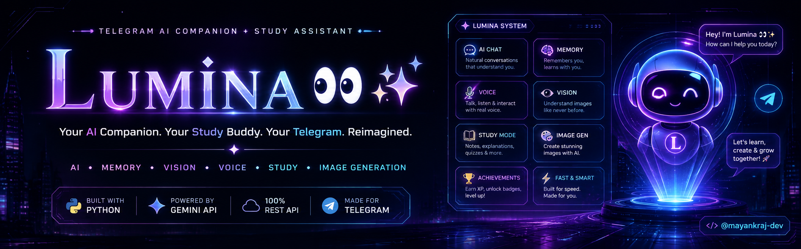

<div align="center">



<br>

# 𝐋ᴜᴍɪɴᴀ 👀✨

### Your AI Companion. Your Study Buddy. Your Telegram. Reimagined.

<p>
  <a href="https://t.me/ChatLuminaBot">
    
  </a>
  <a href="https://github.com/mayankraj-dev/Lumina-Ai-Chatbot">
    
  </a>
</p>

<p>
  
  
  
  
  
</p>

<p>
  <b>💬 Chat</b> •
  <b>🧠 Memory</b> •
  <b>👁️ Vision</b> •
  <b>🎤 Voice</b> •
  <b>📚 Study</b> •
  <b>🎨 Image Gen</b> •
  <b>🏆 Gamification</b>
</p>

</div>

---

## ✨ What is Lumina?

**Lumina** is a feature-rich Telegram AI companion and study assistant designed to make AI feel less like a tool and more like a **personal digital sidekick**.

You can chat with her, ask study doubts, generate structured notes, send images for analysis, send voice messages, create AI images, switch personalities, build long-term memory, earn XP, unlock achievements and compete on a leaderboard — all without leaving Telegram.

> **One bot. Multiple vibes. Infinite possibilities. 👀✨**

---

## ⚡ Why Lumina?

<table>
<tr>
<td width="50%">

### 🤖 AI Companion
Natural conversations with selectable personalities, contextual replies and short-term conversation history.

</td>
<td width="50%">

### 🧠 Long-Term Memory
Lumina can remember useful facts you explicitly share and lets you inspect or erase that memory whenever you want.

</td>
</tr>
<tr>
<td>

### 📚 Study Partner
Study Mode focuses responses around explanations, formulas, step-by-step solutions, revision and exam-style answers.

</td>
<td>

### 🎨 Creative Sidekick
Generate images from prompts, brainstorm ideas, write content and work with visual inputs.

</td>
</tr>
<tr>
<td>

### 🎤 Multimodal
Text, voice/audio and image inputs can all become part of the conversation.

</td>
<td>

### 🏆 Gamified
Earn XP, level up, unlock badges, track activity and climb the leaderboard.

</td>
</tr>
</table>

---

# 🌌 Feature Matrix

| Feature | What it does |
|---|---|
| 💬 **Smart Chat** | AI-powered conversations with contextual short-term history |
| 🧠 **Memory** | Persistent per-user facts stored in SQLite |
| 👁️ **Vision** | Understand and answer questions about images |
| 🎤 **Voice Input** | Understand Telegram voice/audio messages |
| 🔊 **Voice Replies** | Optional spoken replies when a TTS service is configured |
| 📚 **Study Mode** | Exam-focused explanations, formulas, revision and doubt solving |
| 📝 **Notes Maker** | Generate structured notes for any topic |
| 🎨 **Image Generation** | Create images through the configured Gemini image model |
| 🌐 **Web Search** | Optional live search through Serper |
| 🎭 **Personality Modes** | Bestie, Teacher, Funny, Professional, Savage and Motivator |
| 👤 **Profiles** | XP, level, activity, mode and account information |
| 🏆 **Achievements** | Unlock badges based on milestones |
| 📊 **Leaderboard** | See the top XP users and your rank |
| 🎛️ **Inline UI** | Button-based main menu and interactive settings |
| 👥 **Group Awareness** | Responds to commands, mentions and replies in groups |
| 🛡️ **Rate Limiting** | Helps prevent rapid message spam |
| 🔄 **Model Fallback** | Automatically switches models when a configured model fails |
| 💾 **SQLite** | Persistent users, memory, achievements, activity and statistics |
| 📦 **Media Storage** | Telegram media can be mirrored to a private storage/log group |
| 🖥️ **Human-Friendly Logs** | Clean, Gen-Z-style terminal status messages |
| 🛠️ **Admin Tools** | Stats, users, broadcast, maintenance and log controls |

---

# 🎭 Personality System

Lumina isn't stuck with one personality.

Choose the vibe that fits the moment:

| Mode | Vibe |
|---|---|
| 🎀 **Bestie** | Friendly, casual and supportive |
| 📚 **Teacher** | Clear, structured and educational |
| 😂 **Funny** | Light, playful and humorous |
| 💼 **Professional** | Clean, precise and formal |
| 😈 **Savage** | More blunt and teasing |
| 🔥 **Motivator** | Energetic and goal-focused |

Switch anytime with:

```text
/mode
```

---

# 📚 Study Mode

Turn Lumina into a dedicated study partner:

```text
/study
```

Study Mode prioritizes:

- 🧠 Clear explanations
- 🪜 Step-by-step solutions
- 📐 Formulas
- 📝 Short notes
- 🔁 Revision
- ❓ Doubt solving
- 🎯 Exam-style answers
- 📊 Progress tracking

Need structured notes?

```text
/notes Newton's Laws
```

You can also use the interactive Study menu for **Explain → Notes → Revise → Ask Doubt → Progress**.

---

# 🧠 Memory, but under your control

Lumina has two layers of context:

### ⚡ Short-term memory
Keeps the latest conversation context available during the running process.

### 💾 Long-term memory
Stores useful user facts in SQLite so conversations can feel more personalized.

You stay in control:

```text
/memory
```

See what Lumina remembers.

```text
/forget
```

Clear stored memory.

```text
/settings
```

Toggle memory on/off along with other personal settings.

> Lumina's memory system is intentionally lightweight and heuristic-based. It looks for explicit patterns such as a preferred name or what someone is studying instead of making an extra AI call for every memory operation.

---

# 🏆 XP • Levels • Achievements

Talking to Lumina can actually be a little game-like.

### Level path

```text
🌱 Level 1  — Beginner
🔎 Level 2  — Curious
📖 Level 3  — Learner
🚀 Level 4  — Explorer
🧠 Level 5  — Smartie
🏅 Level 6  — Achiever
📚 Level 7  — Scholar
🧩 Level 8  — Mastermind
💡 Level 9  — Genius
👑 Level 10 — Lumina Pro
```

### Badges include

- 🌱 First Chat
- 🧠 Knowledge Seeker
- 📚 Study Starter
- 💻 Code Explorer
- 🔥 Consistent User
- 🏆 Lumina Legend
- 🎨 Digital Artist

Check yours:

```text
/badges
```

See the competition:

```text
/leaderboard
```

---

# 🎨 Multimodal AI

Lumina isn't limited to text.

### 📸 Send an image
Ask Lumina what's inside it, get an explanation or ask questions about the visual.

### 🎤 Send a voice message
Lumina can process voice/audio through the configured AI backend.

### 🖼️ Generate an image

```text
/imagine a futuristic cyberpunk study room with purple neon lights
```

Image generation uses its own configurable model chain, separate from the text/vision/audio chain.

---

# 🌐 Optional Web Search

Lumina can optionally use **Serper** for live web search.

Set:

```env
SERPER_API_KEY=your_serper_key
```

If the key isn't configured, Lumina gracefully works without live search.

---

# 🧩 Command Center

### 💬 Chat

| Command | Description |
|---|---|
| `/start` | Start Lumina / get a welcome message |
| `/help` | Show the command menu |
| `/menu` | Open the interactive menu |
| `/clear` | Clear short-term conversation history |

### 👤 You

| Command | Description |
|---|---|
| `/profile` | View profile, XP, level and activity |
| `/memory` | View remembered information |
| `/forget` | Erase stored memory |
| `/settings` | Configure voice, memory, study mode and language |
| `/mode` | Choose a personality |

### 📚 Study

| Command | Description |
|---|---|
| `/study` | Enter Study Mode |
| `/notes <topic>` | Generate structured notes |

### 🎨 Create

| Command | Description |
|---|---|
| `/imagine <description>` | Generate an AI image |

### 🏆 Community

| Command | Description |
|---|---|
| `/badges` | View achievements |
| `/leaderboard` | View XP rankings |

<details>
<summary>🛡️ Admin commands</summary>

These are restricted to the configured owner username.

```text
/stats
/users
/broadcast <message>
/maintenance on
/maintenance off
/logs
```

</details>

---

# 🏗️ Architecture

Lumina intentionally keeps its core architecture simple:

```text
                 ┌──────────────────────┐
                 │       Telegram       │
                 │   Users / Groups     │
                 └──────────┬───────────┘
                            │
                            ▼
                 ┌──────────────────────┐
                 │     Lumina Bot       │
                 │   Python + REST      │
                 └──────────┬───────────┘
                            │
              ┌─────────────┼─────────────┐
              ▼             ▼             ▼
       ┌────────────┐ ┌────────────┐ ┌─────────────┐
       │   SQLite   │ │ Gemini API │ │   Serper    │
       │ Users      │ │ Chat       │ │ Web Search  │
       │ Memory     │ │ Vision     │ │ (optional)  │
       │ XP/Badges  │ │ Audio      │ └─────────────┘
       │ Stats      │ │ Images     │
       └────────────┘ └────────────┘
```

### Core design choices

- **Plain Telegram Bot API REST calls**
- **Long polling**
- **Python standard library + `requests`**
- **SQLite with WAL mode**
- **Environment-based configuration**
- **Configurable model fallback chains**
- **Defensive retries and timeouts**
- **Inline-button UI**
- **No mandatory third-party Telegram SDK**

---

# 🔄 Model Fallback

One of Lumina's reliability features is its model chain.

Instead of depending on a single model:

```text
Model A
   ↓ fails
Model B
   ↓ fails
Model C
   ↓
Response
```

Temporary failures, rate limits and unsupported/retired models can trigger a switch to the next configured model.

Configure your own chain with:

```env
LUMINA_MODEL=model-a,model-b,model-c
```

Image generation has its own setting:

```env
LUMINA_IMAGE_MODEL=model-a,model-b
```

This keeps model changes configurable without rewriting the bot.

---

# ⚙️ Installation

## 1. Clone the repository

```bash
git clone https://github.com/mayankraj-dev/Lumina-Ai-Chatbot.git
cd Lumina-Ai-Chatbot
```

## 2. Install the dependency

Lumina intentionally keeps dependencies small.

```bash
pip install requests
```

Or:

```bash
python -m pip install requests
```

## 3. Create your environment variables

Set the required values:

```env
TELEGRAM_BOT_TOKEN=your_telegram_bot_token
GEMINI_API_KEY=your_gemini_api_key
```

Optional:

```env
LUMINA_OWNER_USERNAME=roshni_in
SERPER_API_KEY=your_serper_api_key
LUMINA_TTS_API_KEY=your_tts_api_key
LUMINA_DB_PATH=lumina.db
```

Optional model configuration:

```env
LUMINA_MODEL=gemini-3.1-flash-lite,gemini-3.5-flash-lite,gemini-3.6-flash
LUMINA_IMAGE_MODEL=gemini-2.5-flash-image
```

> **Never commit API keys, bot tokens, `.env` files or private credentials to GitHub.**

## 4. Run

```bash
python luminabot.py
```

Lumina uses long polling, so no webhook server is required.

---

# 🔐 Environment Variables

| Variable | Required | Purpose |
|---|:---:|---|
| `TELEGRAM_BOT_TOKEN` | ✅ | Telegram Bot API authentication |
| `GEMINI_API_KEY` | ✅ | Gemini API access |
| `LUMINA_OWNER_USERNAME` | ❌ | Owner/admin username |
| `SERPER_API_KEY` | ❌ | Enables live web search |
| `LUMINA_TTS_API_KEY` | ❌ | Enables spoken voice replies |
| `LUMINA_DB_PATH` | ❌ | Custom SQLite database path |
| `LUMINA_MODEL` | ❌ | Custom text/vision/audio model chain |
| `LUMINA_IMAGE_MODEL` | ❌ | Custom image-generation model chain |

---

# 📁 Project Structure

A minimal deployment can look like:

```text
Lumina-Ai-Chatbot/
│
├── assets/
│   └── lumina-banner.png
│
├── luminabot.py
│
├── lumina.db              # generated at runtime
│
└── README.md
```

The SQLite database is created automatically when the bot initializes.

---

# 🛡️ Reliability & Safety Features

Lumina includes several practical production-minded protections:

- ⏱️ Request timeouts
- 🔄 Retry handling
- 🔀 Model fallback
- 🚦 Per-user rate limiting
- 🧯 Defensive exception handling
- 🧹 Bounded conversation history
- 💾 Persistent SQLite storage
- 🔒 Admin-only controls
- 🛠️ Maintenance mode
- 📊 Internal statistics
- 🖥️ Human-readable terminal events
- 🧾 High-level audit logging
- 🔐 Secrets loaded from environment variables

The bot also avoids exposing API keys, system prompts or internal model details to end users.

---

# 🖥️ Human-Friendly Terminal

Instead of flooding the terminal with unreadable technical output, Lumina keeps runtime events simple:

```text
🚀 Started • Lumina is online
👋 New user • someone joined
💬 Message received
🧠 Lumina is thinking...
🤖 AI reply sent ✓
📦 Image received • saving...
🔄 Changing model...
🟢 Done ✓
```

Technical logging remains available for debugging without making the normal console experience chaotic.

---

# 🗃️ Data & Storage

Lumina uses SQLite for persistent application data, including:

- User profiles
- XP and levels
- Memory facts
- Achievements
- Activity counters
- Global bot statistics
- Preferences

Telegram media can also be mirrored to a configured private storage/log chat by the bot's deployment configuration.

**Deployment note:** if you run Lumina somewhere temporary or ephemeral, make sure the SQLite database is backed up if you need persistence.

---

# 📸 Showcase

The project includes a dedicated visual identity built around a:

> **Cyberpunk AI × Telegram × Study Desk × Holographic UI**

The README banner lives at:

```text
assets/lumina-banner.png
```

More screenshots can be added under:

```text
assets/screenshots/
```

---

# 🧰 Tech Stack

<div align="center">

| Layer | Technology |
|---|---|
| 🤖 Bot | Telegram Bot API |
| 🐍 Language | Python |
| 🧠 AI | Gemini API |
| 👁️ Vision | Gemini multimodal input |
| 🎤 Audio | Gemini audio input |
| 🎨 Image Gen | Gemini image model |
| 🌐 Search | Serper API — optional |
| 💾 Database | SQLite |
| 🔌 Networking | REST / HTTP |
| 🔄 Runtime | Long Polling |
| 🎛️ UI | Telegram Inline Keyboards |

</div>

---

# 🚀 Roadmap

Some directions that can make Lumina even bigger:

- [ ] Better memory controls and memory categories
- [ ] More study tools
- [ ] Custom user themes
- [ ] Richer analytics
- [ ] More achievement types
- [ ] Improved multilingual support
- [ ] More media formats
- [ ] Better deployment tooling
- [ ] Modular plugin architecture
- [ ] Automated tests
- [ ] Docker deployment

---

# 🤝 Contributing

Found a bug? Have a cool idea? Want to improve Lumina?

1. Fork the repository
2. Create a branch

```bash
git checkout -b feature/your-feature
```

3. Make your changes
4. Test locally
5. Commit

```bash
git commit -m "feat: add your feature"
```

6. Push your branch
7. Open a Pull Request

Keep contributions focused, readable and respectful.

---

# 🧑‍💻 Credits

<div align="center">

### 👑 Owner / Maintainer

**@roshni_in**

### 💻 Repository / Development

**@mayankraj-dev**

<br>

Built with Python, Telegram, REST APIs and a lot of ✨ energy.

</div>

---

# 📬 Connect

<div align="center">

| Platform | Link |
|---|---|
| 🤖 Lumina | [@ChatLuminaBot](https://t.me/ChatLuminaBot) |
| 💻 GitHub | [@mayankraj-dev](https://github.com/mayankraj-dev) |
| 📸 Instagram | [@mayankraj_in](https://instagram.com/mayankraj_in) |
| ✈️ Telegram | [@mayankraj_dev](https://t.me/mayankraj_dev) |

</div>

---

# ⚠️ Disclaimer

Lumina is a personal/open-source project and depends on external services such as Telegram and Gemini.

AI responses can be inaccurate. Do not rely on Lumina as the sole source for medical, legal, financial, safety-critical or other high-stakes decisions.

API availability, model names, quotas and pricing are controlled by their respective providers and may change independently of this project.

---

<div align="center">

## ⭐ If Lumina helped you, consider starring the repo.

**Build. Learn. Create. Repeat. 👀✨**

<br>

`𝐋ᴜᴍɪɴᴀ` • `AI` • `MEMORY` • `VISION` • `VOICE` • `STUDY` • `CREATE`

</div>
